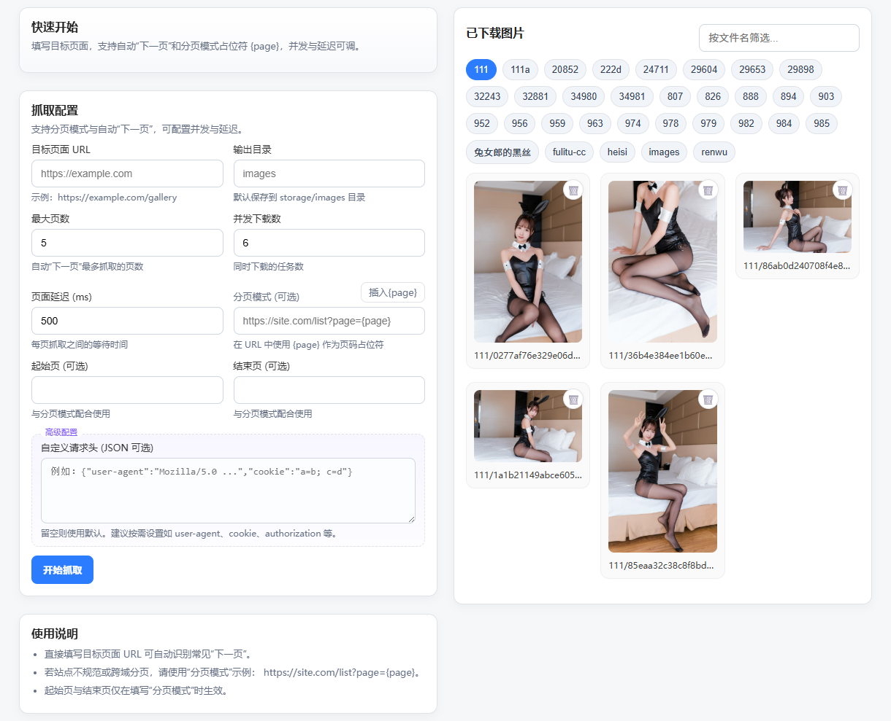
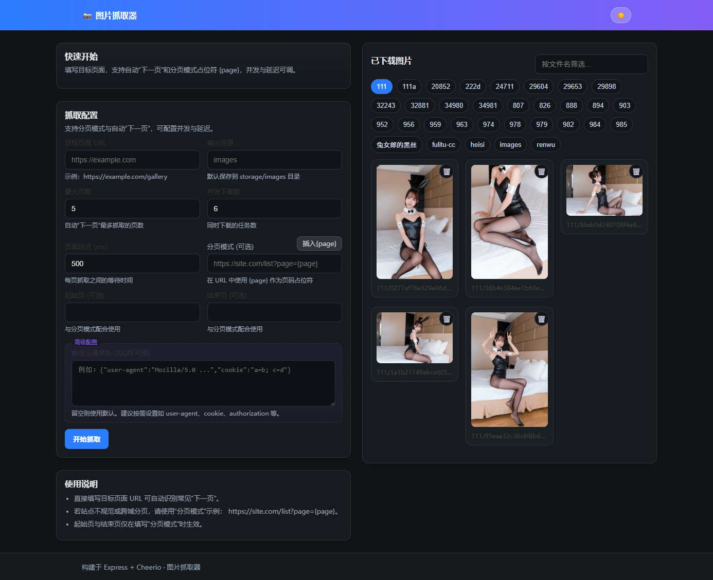
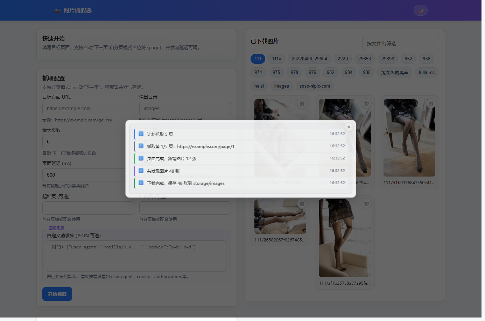
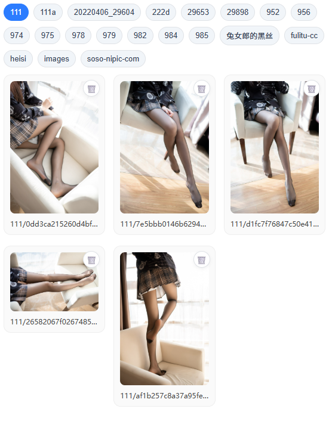
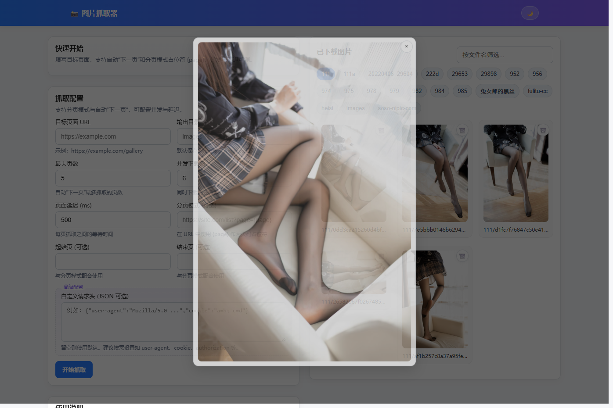

# 图片抓取器（image-crawling）

一个基于 Express 的网页图片抓取器与浏览器前端界面。支持自动跟随“下一页”或使用自定义分页模式，提取页面中的图片链接并并发下载到本地 `storage` 目录。内置前端页面用于配置抓取参数、实时查看进度（SSE）和浏览已下载图片。

## 功能特性

- 自动识别常见“下一页”（`rel=next`、`.next`、文本匹配等）
- 分页模式占位符：支持 `https://site.com/list?page={page}`
- 并发下载与每页抓取延迟、网络超时可配置
- 可选使用 headless 浏览器（Puppeteer）渲染以应对动态页面和风控
- 支持自定义请求头（User-Agent、Cookie、Authorization 等）
- 前端 UI：表单配置、进度日志、目录分组展示、文件名搜索、图片预览
- 图片列表 API：按顶层目录分组，支持删除已下载文件

## 技术栈

- 后端：`Express`、`cheerio`、`node-fetch`、`Puppeteer`
- 前端：原生 HTML/CSS/JS（无框架），`EventSource`(SSE) 实时进度

## 目录结构

```
.
├── server/
│   ├── app.js                 # 应用入口（启动 Web 服务）
│   ├── lib/
│   │   ├── config.js          # 存储根目录与工具方法
│   │   └── crawl.js           # 抓取与下载核心逻辑
│   ├── middlewares/
│   │   └── errors.js          # 404 与错误处理
│   └── routes/
│       ├── index.js           # 首页（返回 views/index.html）
│       ├── crawl.js           # 抓取接口与进度流（SSE）
│       └── images.js          # 图片列表与删除接口
├── views/
│   ├── index.html             # 前端页面
│   ├── css/main.css           # 页面样式
│   └── js/main.js             # 前端交互脚本
├── storage/                   # 图片输出目录（运行时生成，默认忽略提交）
├── package.json
└── README.md
```

## 环境要求

- Node.js ≥ 18（推荐 18 或更高版本）
- 包管理器：pnpm 或 npm（本项目声明 `packageManager: pnpm@10`）
- Windows/macOS/Linux 均可运行；使用 headless 渲染时 Puppeteer 可能下载 Chromium（首次安装较慢）

## 快速开始

1. 安装依赖

- 使用 pnpm：
  ```bash
  pnpm install
  ```
- 或使用 npm：
  ```bash
  npm install
  ```

2. 启动服务

```bash
pnpm start
# 或
npm start
```

- 默认监听端口 `3000`，可通过环境变量修改：
  ```bash
  PORT=8080 pnpm start
  ```

3. 打开前端页面

- 访问 `http://localhost:3000/`
- 填写“目标页面 URL”，可选设置分页模式 `{page}`、并发与延迟、请求头 JSON 等
- 点击“开始抓取”，在右侧模态层查看实时进度与最终结果
- 下载结果保存在 `storage/<outDir>`（默认 `storage/images`）

## 示例截图

运行后界面示例（以下文件位于 `views/image/screenshots/`，可按下文命令自动生成）：

- 首页（浅色）：`views/image/screenshots/home-light.png`
- 首页（深色）：`views/image/screenshots/home-dark.png`
- 进度日志：`views/image/screenshots/progress.png`
- 图片网格：`views/image/screenshots/images-grid.png`
- 预览模态：`views/image/screenshots/preview.png`

直接查看：







### 生成示例截图

1. 先在一个终端启动服务：`pnpm start`（或 `npm start`）
2. 在另一终端执行：`pnpm run capture`（或 `npm run capture`）

脚本会自动访问 `http://localhost:3000/`，切换浅/深色主题，展示进度模态，捕获页面与组件截图并保存到 `docs/screenshots/`。

## 使用说明

- 自动“下一页”适用于常见分页按钮或链接；若站点不规范或跨域分页，建议使用“分页模式”并设置起始/结束页。
- 合理设置并发与延迟，避免对目标站点造成压力。
- 如遇反爬或需执行脚本渲染，可勾选 `useHeadless` 使用 Puppeteer 进行页面渲染并提取图片。
- 支持自定义请求头 JSON，例如：
  ```json
  {
    "user-agent": "Mozilla/5.0 ...",
    "cookie": "a=b; c=d",
    "authorization": "Bearer <token>"
  }
  ```

## API 文档

### GET `/`

- 返回前端页面 `views/index.html`。

### POST `/api/crawl`

- 触发抓取与下载。
- 请求体（JSON）：
  ```json
  {
    "url": "https://example.com/gallery",
    "options": {
      "outDir": "images",            // 输出子目录（相对 storage）
      "concurrency": 1-10,            // 并发下载数，默认 5
      "maxPages": 1-50,               // 自动“下一页”最多抓取的页数，默认 10
      "pageDelayMs": 0-2000,          // 每页抓取之间的等待时间，默认 500ms
      "fetchTimeoutMs": 1000-60000,   // 网络请求超时，默认 15000ms
      "pagePattern": "https://site.com/list?page={page}",
      "startPage": 1,
      "endPage": 10,
      "useHeadless": true/false,      // 是否使用 Puppeteer
      "headers": {                    // 可选自定义请求头（键名大小写不敏感）
        "user-agent": "...",
        "cookie": "...",
        "authorization": "..."
      }
    }
  }
  ```
- 响应示例：
  ```json
  {
    "count": 42, // 发现的图片总数
    "saved": [
      // 已保存文件列表
      { "url": "https://.../a.jpg", "file": "a.jpg" }
    ],
    "outDir": "storage/images" // 实际输出目录（相对项目根）
  }
  ```

### GET `/api/crawl/stream`

- 通过 SSE 输出实时进度；查询参数与 `POST /api/crawl` 的 `options` 一致（需包含 `url`）。
- 事件类型（`data:` 为 JSON）：
  - `plan`：规划页数，如 `{ type:"plan", pages: 5 }`
  - `page`：开始抓取某页，如 `{ type:"page", index:1, total:5, url:"..." }`
  - `fallback`：网络错误或 HTTP 失败，尝试 headless 渲染
  - `page_done`：某页处理完成，新增图片数量
  - `discover`：解析结束后发现的图片总数
  - `complete`：全部下载完成，给出保存数量与目录
  - `result`：最终结果对象（同 `POST /api/crawl` 响应）
  - `error`：任务异常

### GET `/api/images`

- 返回已下载图片列表，按顶层子目录分组：
  ```json
  {
    "groups": [
      { "dir": "root", "files": ["a.jpg", "b.png"] },
      { "dir": "album1", "files": ["album1/c1.jpg", "album1/c2.jpg"] }
    ],
    "total": 123
  }
  ```

### DELETE `/api/images`

- 删除已下载的单个图片文件。
- 请求体或查询参数：`name`（相对 `storage` 的路径，例如 `album1/c1.jpg`）
- 响应：`{ ok: true }`

## 常见问题

- `storage` 目录默认被 `.gitignore` 忽略，不会提交到仓库；运行时会自动创建。
- 使用 headless 渲染时，首次安装 Puppeteer 可能耗时较长；如无需该功能，可不勾选或移除依赖。
- 某些站点对抓取有限制，请遵守其服务条款与 robots.txt，合理设置并发与延迟。

## 许可证

- ISC（见 `package.json`）
